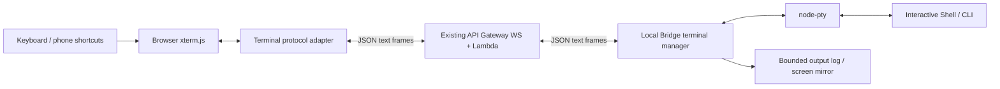

# xterm.js + PTY Remote Terminal Design

> Status: the project entry, Header direct relay, and multi-client shared PTY are implemented; on-device phone compatibility acceptance is still required.
>
> Continuous output optimization: ordinary output is submitted to xterm continuously in receive order, without waiting for a per-packet parse callback; non-output
> messages still wait for prior writes to complete, preserving the order of resize, snapshots, and session switches. render_ack and backlog byte deduction
> still run after the write completes; closing the page releases the wait, and callbacks from an old connection do not acknowledge data from a new connection. No coalescing delay,
> byte concatenation, or WebGL was added, and the communication protocol was not changed.
>
> 2026-09-22 phone input, first version: only the native Android / iOS App mounts phone controls; when the keyboard is up it shows a
> single-row bar of `Esc / Tab / Ctrl / Shift / Alt / Paste / Enter`; when the keyboard is dismissed it is hidden and takes no terminal space.
> A long press in place on the terminal for 450ms enables a four-way joystick, with an extra 10px margin on all sides, centered when space is insufficient; after avoidance, direction is still
> computed from the displayed center. When the offset along the primary direction is under
> 25px it stops sending; from 25/40/60px it repeats at 300/150/70ms respectively, and the top speed is reachable inside the arrow buttons.
> Releasing stops sending but keeps the joystick; you can tap a direction key, or hold for 300ms to repeat at 70ms intervals; tapping outside only
> dismisses the joystick without toggling the keyboard, and swiping outside still scrolls normally. Cancel, session switch, and backgrounding stop and hide it.
> The joystick only sends arrow keys; when not activated, ordinary short taps and swipes keep the original logic.
> 2026-09-29 Paste now reads text natively through Tauri clipboard-manager and then hands it to xterm `paste()`,
> no longer calling the WebView Clipboard API inside the App, avoiding the extra WebKit Paste confirmation bubble; the system may still
> require paste authorization. The text-read permission is enabled only on mobile, and reading happens only on tap; if the native read fails an error is shown,
> without falling back to triggering the WebView confirmation. Browsers keep the Clipboard API. The App must be rebuilt; iOS users have confirmed
> paste works, Android is still pending acceptance. This change does not touch the scroll library, backend, or transport protocol.
>
> 2026-09-21 phone scrolling experiment: the frontend pins the official `@xterm/xterm@6.1.0-beta.304` and the matching
> `@xterm/addon-fit@0.12.0-beta.301`, disables the project's own `attachTerminalTouchScroll`, and lets the official gesture handling take over.
> The 14px font size, 6px scrollbar, and existing PTY protocol are kept; the old touch module and tests remain for now as fallback reference and are no longer mounted.
> This is a beta for user acceptance and does not mean the phone experience is verified. Upstream #6059 / #6108 still report that in mouse-reporting mode
> flinging may send `NaN` coordinates; test ordinary Shell history first, then accept full-screen programs separately; no unmerged patches were introduced.
>
> 2026-09-22 Paseo comparison (trunk `83f9fba`): the App lockfile has xterm `6.1.0-beta.213`,
> FitAddon `0.12.0-beta.213`. Its Web / legacy WebView runtime still mounts self-written touch handling,
> accumulating vertical displacement by line height and passing it to `scrollLines()`; that handling clears state on release, with no extra inertia phase.
> The new native grid separately uses `@xterm/headless` and React Native PanResponder. This differs from our latest approach of disabling self-written
> scrolling and handing over to beta.304 official gestures, so this change does not port or layer on those scroll handlers.
>
> 2026-09-17 update: the current implementation follows the "Project Shared Terminal" section of `docs/terminal-direct-integration.md`.
> The single writer, takeover lease, unified terminal action, and replay protocol in the original design below are not the current implementation.
> The user explicitly chose that all connected pages can type; usually only one person operates, so no preemption or write lock is added.
>
> Original baseline: 2026-09-16, `main` / `f3fd719`; design branch: `xterm`.
> The old pipe approach is saved in `checkpoint/terminal-pipe-baseline-20260915` / `f8c22f9`.
>
> Initial validation used an isolated local POC (§15.2) and a cloud WS POC (§15.3), without restarting the existing Bridge.
> On 2026-09-17 the project terminal page was deployed, the cloud control interface updated, and the local main Bridge updated / restarted;
> on the live page connected directly to that main Bridge, dual-client input at desktop / phone sizes and recovery after disconnect were both verified.
>
> The subsequent Header direct relay POC is implemented: see `docs/terminal-direct-integration.md`.
> Because testing showed IAM cannot restrict a single connection ID, data uses a separate hosted WS API + session HMAC, and the original API only does control.
> The controlled POC passed browser acceptance; API-level STS permissions are not to be mislabeled as connection-level ACLs suitable for untrusted multi-tenancy.

## 1. Conclusion and Scope

Long term, adopt **xterm.js + local PTY + the existing WebSocket channel**, implementing the terminal as an independent subsystem.

- xterm.js handles the browser-side terminal screen, VT control sequences, cursor, selection, and keyboard input.
- PTY gives the local Shell / CLI a terminal interface rather than ordinary stdin/stdout pipes.
- WebSocket handles data transport with authentication, ordering, flow control, and recovery.
- The cloud does not create PTYs, execute commands, or parse terminal screens. Commands still run on the device the user selected.

Replacing only the frontend rendering library cannot fix non-TTY programs refusing to start or prompts not being printed; adding only a PTY while still
using an ordinary log area cannot fully present applications such as Vim. The typical integration officially recommended by xterm.js is to connect it
bidirectionally with a PTY.[R1][R2]

### 1.1 Goals of the first releasable version

1. Persistent interactive Shell on macOS and Linux, correctly displaying install wizards and prompts without newlines.
2. Support Vim, pagers, interactive selection, arrow keys, Tab, Esc, Ctrl combinations.
3. Support desktop browsers, phone browsers, and the existing Tauri mobile container; phone compatibility must be accepted on real devices.
4. Support window size changes, short reconnects to the same session, and a clear session lifecycle.
5. Input is never executed twice and VT data is never silently dropped; when recovery is impossible, say so clearly instead of faking a complete screen.
6. Keep the Reset confirmation dialog; going back only drops the subscription and does not terminate the PTY.

### 1.2 Not in this round

- No `Need input`. A PTY provides no general "application is waiting for user input" business event.
- No Clear button; do not port the old command cards, exit-code statistics, or Git suggestion bar.
- Do not emulate a Vim editor, and do not switch to a custom editing component after recognizing a command.
- No multi-user collaborative editing, multiple terminal tabs, file transfer, ZMODEM, screen recording, or on-disk terminal history.
- No guarantee that processes survive a Bridge restart; that requires an additional tmux / session daemon layer.
- Windows ConPTY is deferred to a later, separate acceptance phase; it does not ship by default just because node-pty claims support.

## 2. Starting from main, which code can be borrowed

Do not cherry-pick the whole old branch and then swap the renderer. The old data model is "execute one command";
the new data model is "connect to a persistent terminal".

| Location | main status / reusable part | Handling in this design |
|---|---|---|
| `bridge/ws.mjs` | Existing authenticated connection, heartbeat, message dispatch, exit cleanup | Only add terminal dispatch and a session cleanup entry |
| `bridge/session.mjs` | `projectHashToPath` | Reuse for location, then realpath, directory check, and permission validation |
| `bridge/project/ws-frames.mjs` | Checks frames by full JSON size | Borrow the size check; do not directly reuse the text RPC chunking protocol |
| `bridge/bridge.mjs` | Downloads updates, replaces files, and restarts | Must add an update-deferral policy for active PTYs |
| `server/src/bridge_ws.py` | Dispatch by action, connection identity lookup, targeted send | Keep the existing entry, add an independent terminal handler |
| `server/src/project/git_ws.py` | Request whitelist, trusted routing field construction | Borrow the validation and targeted routing approach |
| `web/js/ws.js` | Shared WS, reconnect, mobile viewport handling | Reuse the connection; terminal input does not use its offline generic send queue |
| `web/js/ws-rpc.js` | Promise and timeout for bounded request/response | Can borrow for control requests; cannot be used to assemble an unbounded terminal stream |
| `web/js/edge-back.js`, shared Header | Page back, gestures, and project navigation | Reuse; do not reimplement global navigation |
| `web/js/git/discard-confirm.js`, `.modal-*` | Existing confirmation dialog styles | Reuse styles; borrow the old terminal Reset interaction tests |
| Old branch `web/js/terminal/page.js` | Top entry, Reset dialog, page shell | Borrow selectively only; do not copy the old input and output model |
| Old branch `bridge/config.mjs` | Preserves user config at CLI startup | Keep this fix idea to avoid losing the terminal switch on upgrade |

Explicitly not carried over from the old version: the fd 3 / nonce command execution loop, `eval`, `execId` command cards, the Bash `read`
override function, manual stdin echo, dropping output after it reaches 2 MB, and full `innerHTML` re-render every time.

The old settings such as `PYTHONUNBUFFERED=1`, `PAGER=cat`, `GIT_TERMINAL_PROMPT=0`, `ls -C`
also cannot be copied directly into a full terminal; programs should work on their own based on the real PTY and the user's Shell configuration.

## 3. Overall Architecture



This is a new PTY session created by the Bridge, not a reading of a Terminal.app window the user already has open.
The browser running on a phone does not mean the Shell runs on the phone either.

### 3.1 The two paths must be separate

- **Control path**: capability probing, open, attach, Reset, close, status query; has request IDs and results.
- **Data path**: keyboard bytes, terminal output, size events, ACK, replay; uses explicit sequence numbers and windows.

Keep using the current connection; do not open another unauthenticated bare WS. Do not use addon-attach directly on
the current shared WS: that addon treats WS content as terminal data by default, while the existing connection also carries chat, Files, Git
and other JSON messages. A thin, dedicated terminal protocol adapter is needed.[R3]

## 4. Dependencies and Technology Choices

The following are stable candidates found in npm publish metadata during the 2026-09-15 research; this does not mean they are verified to be mutually compatible:

| Dependency | Candidate version | Purpose | Install location |
|---|---|---|---|
| `@xterm/xterm` | `6.0.0` | Browser terminal | Root package.json, lazy-loaded |
| `@xterm/addon-fit` | `0.11.0` | Compute rows/cols from the container | Root package.json |
| `node-pty` | `1.1.0` | Local PTY | bridge/package.json |
| `@xterm/headless` | `6.0.0` | Backend screen mirror candidate | bridge/package.json, introduced in the recovery phase |
| `@xterm/addon-serialize` | `0.14.0` | Screen serialization candidate | bridge/package.json, introduced in the recovery phase |

The publish metadata for these packages states MIT. Before implementation, lock exact versions and the lockfile, and run
API, rendering, and native module tests on those versions; do not depend on the master branch or unverified experimental APIs.[R1][R2][R16]

- Do not introduce all addons such as WebGL, search, hyperlinks, clipboard; add them as needed once basic functionality is stable.
- xterm has its own terminal parsing and incremental writing; Anser is no longer used to generate HTML for this page.
- `node-pty` has native dependencies; installation and upgrade must be verified on macOS arm64/x64 and target Linux architectures.
- The `node-pty` candidate version supports `encoding: null` and `write(string | Buffer)`; its `onData`
  type declaration still needs to be checked against actual runtime results. Byte adaptation cannot be guessed from type declarations alone.[R17]

## 5. Bridge Session and Shell Startup

### 5.1 Session identity

- `terminalId`: UUID generated by the Bridge, identifying one terminal session.
- `epoch`: UUID changed every time the underlying PTY is created/reset; input from an old epoch is always rejected.
- `bridgeInstanceId`: generated at Bridge startup, used to detect service restarts, not an authentication credential.
- `clientId`: random ID for a browser tab, may be stored in sessionStorage; input content is not saved.
- `attachmentId`: random ID generated on each successful attach, bound to the current connection and control.

In the first version each device and each project has only one terminal; at most 4 per device. When no slot is available, return a clear error,
rather than inferring that an existing Shell "looks idle" and killing it.

Internal state includes at least: PTY handle, actual project path, Shell, rows/cols, epoch, output sequence number,
input sequence number, controller, recovery window, mirror write queue, flow-control reason set, exit result, and request dedup table.

### 5.2 Shell and environment

1. The Bridge selects the Shell from the local user configuration; prefer the user's explicit configuration, then the system login Shell.
2. Initially only accepted macOS/Linux Shells are supported. Arbitrary executable/argv/env from the frontend must not be accepted.
3. The initial cwd is `realpath`-ed after project location, and checked to exist and be a directory; on failure, do not fall back to an unrelated directory.
4. Start the Shell inside the PTY in login, interactive mode; no more Bash bootstrap command loop.
5. The environment keeps the necessary `HOME/USER/LOGNAME/SHELL/PATH/LANG/LC_*` and sets the terminal type;
   the user's pyenv/nvm etc. are initialized by the actual login Shell, avoiding PATH being reordered again by another Shell.
6. Do not pass the Bridge's API key, install parameters, or service-specific environment wholesale to child processes.
7. xterm theme, TERM, and character width match the backend mirror configuration; a UTF-8 terminal is the first-version scope.

`TERM=xterm-256color` now corresponds to a real PTY, rather than using an environment variable to pretend a pipe is a terminal.
Environment consistency must compare the new Shell's interpreter paths against the user's local login Shell, not just check whether commands can be found.

### 5.3 Input, output, and echo

- Output: PTY bytes → chunking/mirror/sequence number → WS → `terminal.write(Uint8Array)`.
- Ordinary input: strings from `terminal.onData` are UTF-8 encoded and enter the ordered input queue.
- Binary input events: `terminal.onBinary` is converted by single byte value and must not be UTF-8 encoded a second time.
- The Bridge writes to the PTY through a byte-preserving adapter layer; Buffer behavior is a P0 must-test item.
- Do not uniformly append `\n`; Enter, arrow keys, and control keys all send the actual terminal input sequences.
- The terminal only displays real PTY output and does not manually write input echo. On 2026-09-16 the desktop input preview was removed, keeping the real network latency,
  to make it easier to compare the EC2 and local public-internet links; for the current scope see `docs/terminal-direct-integration.md`.

### 5.4 Lifecycle

| Operation | Semantics |
|---|---|
| open | Create or find an existing terminal for the project; repeated requests do not start the process again |
| attach | Bind the controller, restore the screen, allow input only after recovery completes |
| Back / detach | Stop the page subscription, keep the PTY; do not call Reset |
| Network disconnect | Block new input, enter reconnecting state; do not automatically send accumulated keystrokes to the new session |
| Reset | After dialog confirmation, terminate the old PTY, clear the screen, change epoch, start a new Shell in the project's initial directory |
| close | Explicitly close the terminal, release process and memory, do not immediately reopen automatically |
| Shell exits on its own | Emit an ordered exit, page becomes read-only; the user actively chooses to reopen |
| Bridge restart | Original PTY not guaranteed to survive; old session becomes invalid, commands are not replayed automatically |

"Reset returns to the project's initial directory" is an explicit semantic of the new design, not relying on the cwd the old version happened to keep.
The first version does not judge a command idle based on no output or no keystrokes, and does not automatically clean up still-alive PTYs.

Exit cleanup must test the foreground process group and child processes, not just verify that the Shell PID disappears. Tasks that actively `nohup/setsid`
to detach from the session are not promised to be fully reclaimed by Reset; a PTY is not a process or filesystem sandbox.

Auto-upgrade is deferred while active PTYs exist: it may check for a new version, but must not replace native dependencies first and then postpone the restart.
Install and restart only after all terminals are closed, or when the user explicitly confirms interrupting for the upgrade.

## 6. WebSocket Protocol v1

Use one new action: `terminal`, distinguishing messages by `v: 1` and `op`. It is not compatible with the meaning of the old
`terminal_exec/terminal_stdin/...`, and does not reuse the chat Session's turnId/seq.

### 6.1 Common fields and trust boundary

| Field | Rule |
|---|---|
| action / v / op | Fixed action, integer version, op whitelist validated per role |
| device | Existing device identifier, not the display name; the server must target exactly one Bridge |
| projectHash | Max 2048 UTF-8 bytes; the Bridge verifies it matches the project bound to the terminal |
| requestId | Control request UUID; retries must reuse the original value |
| terminalId / epoch | UUID; required for operations on an existing terminal |
| clientId / attachmentId | Control and reconnect identity; cannot replace account authentication |
| seq | The Bridge's ordered terminal event sequence number, starting at 1 for each epoch |
| clientSeq | Input/resize sequence number of the current attachment, starting at 1 |
| data | Standard Base64 of terminal bytes; not escaped ANSI text |

The client cannot specify trusted `accountId/sourceConnectionId/replyConnectionId`. The server derives account and role from the current
connection record, rebuilds the request from a whitelist, and injects trusted routing information. The Bridge's response target
comes from the bound attachment, not from an arbitrary connection ID in the input data.

### 6.2 App → Bridge

| op | Required business fields | Semantics |
|---|---|---|
| probe | device, requestId | Return enabled state, protocol, platform, limits, and actually available capabilities |
| open | projectHash, requestId, cols, rows | Create/find the project terminal, without directly taking control |
| attach | terminalId, epoch, clientId, requestId, screenPresent, lastSeq, takeover | Restore the screen and obtain an attachment |
| input | terminalId, epoch, attachmentId, clientSeq, data | Write raw input bytes in order |
| resize | Same identity/sequence as input, cols, rows | Shares ordering with input, resizes PTY and screen |
| ack | Identity fields, seq, optional syncId | Confirm the contiguous event sequence number applied to xterm |
| replay | Identity fields, fromSeq | Request replay from the gap; cannot request data of other terminals |
| snapshot_ack | Identity fields, snapshotId, nextChunk | Confirm contiguously received snapshot chunks, releasing the snapshot send window |
| keepalive | Identity fields | Renew control; recommended once every 30 seconds |
| detach | Identity fields, requestId | Release current control without terminating the process |
| state | terminalId, epoch, requestId | Query current session/request result, does not execute commands |
| reset / close | Identity fields, requestId | Explicit destructive operations with dedup guarantees |

The above is the original single-writer protocol draft, superseded by the 2026-09-17 shared terminal implementation.
Currently there is no `takeover`, write lease, or `terminal_in_use`; each page has its own connection and input sequence numbers;
the Bridge orders by each connection's contiguous sequence numbers, then writes to the same PTY in arrival order. No command-level atomicity across devices.
Disconnect only releases the current page connection and does not kill the PTY; reconnect recovers via an authoritative screen snapshot without replaying input.

### 6.3 Bridge → App

| op | In seq stream? | Meaning |
|---|---|---|
| capabilities | No, matches requestId | backend, protocol version, enabled state, capabilities, and limits |
| opened / attached / result / state | No, matches requestId | Control request result, epoch, attachment, or state |
| output | Yes | Base64 terminal output |
| resized | Yes | Authoritative cols/rows and the corresponding clientSeq |
| flow | Yes | Data channel flow-control state; does not mean a command is waiting for input |
| exit | Yes | PTY exit result; not the exit code of an arbitrary Shell command |
| input_ack | No | Contiguous clientSeq accepted for the current attachment |
| lease | No | Renewal result for the current attachment |
| snapshot_begin / snapshot_chunk / snapshot_end | Independent chunkIndex | Screen snapshot of one sync transaction |
| error | No, linked to a request or sequence number | Explicit error, rather than signaling failure with a permanent loading state |

Control results use `ok: true/false` in JSON. Errors carry at least `errorCode`, and as needed requestId,
clientSeq, expectedClientSeq, terminalId, epoch; error messages must not contain input content or credentials.

### 6.4 Examples

The following are structural examples; UUIDs are placeholders; internal routing fields injected by the server do not appear in client requests.

```json
{
  "action": "terminal",
  "v": 1,
  "op": "open",
  "requestId": "11111111-1111-4111-8111-111111111111",
  "device": "MacBook-Pro",
  "projectHash": "-workspace-project",
  "cols": 80,
  "rows": 24
}
```

```json
{
  "action": "terminal",
  "v": 1,
  "op": "input",
  "device": "MacBook-Pro",
  "projectHash": "-workspace-project",
  "terminalId": "22222222-2222-4222-8222-222222222222",
  "epoch": "33333333-3333-4333-8333-333333333333",
  "attachmentId": "44444444-4444-4444-8444-444444444444",
  "clientSeq": 1,
  "data": "bHMN"
}
```

In the example above, data represents `ls` followed by a carriage-return byte. Production code must encode the real input bytes, and must not treat
visible characters such as `\\r` as a carriage return. A lone carriage-return byte `0x0d` encodes as `DQ==`, and Ctrl+C `0x03` as `Aw==`.

```json
{
  "action": "terminal",
  "v": 1,
  "op": "output",
  "terminalId": "22222222-2222-4222-8222-222222222222",
  "epoch": "33333333-3333-4333-8333-333333333333",
  "attachmentId": "44444444-4444-4444-8444-444444444444",
  "seq": 7,
  "data": "aGVsbG8NCg=="
}
```

The output example represents `hello` plus CRLF. Data frames are consumed only by the current terminal adapter layer and do not enter the chat renderer.

### 6.5 Ordering, idempotency, and input safety

1. Do not assume results passing through multiple Lambda invocations still arrive in the original order. output, resized, and exit share seq.
2. The browser applies only contiguous seq; duplicates are dropped, gaps are replayed first, and drawing must not skip control sequences to continue.
3. input and resize share clientSeq; the Bridge executes in order, buffers a bounded number of out-of-order items, and reports gaps.
4. Within the same attachment, a duplicate clientSeq does not write to the PTY again; the same sequence number with a different payload is rejected.
5. input_ack means the Bridge accepted and submitted to the PTY write path, not that the application has read it or completed the command.
6. Dedup is a guarantee within the same Bridge/epoch; exactly-once across process crashes is not claimed.
7. When the attachment or epoch changes after reconnect, unacknowledged input must not be resent automatically; indicate that execution state may be unknown.
8. open/reset/close dedup by requestId; retrying the same request returns the original result without re-creating or killing processes.
9. The Reset dedup table must be queried before the old-epoch rejection logic, so the original request of a successful Reset gets the same result.
10. Sequence numbers must be integers in the safe range; an ACK must not exceed the boundary already sent for the current attachment, and duplicate and
    backward ACKs do not release extra credit. Replay ranges, out-of-order buffers, and control request dedup tables must all have count/time limits.

main's `wsSendReliable` queues data when not OPEN and sends it after reconnect. Terminal input
must not call it directly. A new terminal send adapter reuses the socket, sends only when OPEN and the attachment is synced,
and bounded retries are managed by the terminal's own ACK/dedup logic. This rule does not change the send behavior of chat or other existing features.

## 7. WS Size Limits, Encoding, and Flow Control

### 7.1 Current AWS limits

According to the AWS official documentation checked this time:[R6][R7]

| Item | Official limit / behavior | Design impact |
|---|---|---|
| WebSocket frame | 32 KB | Every application send packet must be below the limit |
| Message payload | 128 KB | Cannot use this to send a single 128 KB frame |
| Inbound binary frames | Not supported, may disconnect with 1003 | Use JSON text frames, bytes in Base64 |
| Oversized frame/message | May disconnect with 1009 | Check length after encoding, do not rely on underlying automatic fragmentation |
| Maximum connection duration | 2 hours | Must support normal connection rotation and re-attach |
| Idle timeout | 10 minutes | Reuse heartbeat; cannot assume no output means never disconnecting |
| integration timeout | 50 ms–29 seconds | Lambda only handles a single forward; commands cannot wait for completion in Lambda |

ttyd's binary WS protocol cannot be ported directly. Its input/output/flow-control ideas can be borrowed, but the transport encapsulation must
adapt to the existing API Gateway. Re-verify when AWS configuration changes in the future; do not treat researched values as constants that never change.

### 7.2 Our own initial budget

The following are design values pending load testing, not AWS quotas:

| Parameter | Initial value |
|---|---|
| Full JSON frame budget | 28 KiB, including trusted routing fields and the final serialized result |
| Raw data per output/snapshot chunk | At most 16 KiB |
| Raw data per input chunk | At most 4 KiB |
| Metadata budget | At most 4 KiB, with separate length limits on all variable fields |
| Single paste | At most 256 KiB, split into ordered input chunks; reject rather than truncate when over limit |
| Output coalescing | First chunk sent promptly; consecutive small chunks coalesced for at most about 16 ms |
| Input coalescing | Ordinary consecutive input at most about 8 ms; Enter/Esc/Ctrl+C flushed promptly |
| Client unapplied-output high/low watermark | 512 KiB / 128 KiB raw bytes |
| Single recovery snapshot limit | 4 MiB, chunked with an independent window |
| Replay log per PTY | 8 MiB, bounded; old segments may be evicted only when a correct recovery path exists |
| Screen mirror scrollback | Initially 1000 lines; actual heap memory monitored separately |
| Rows/cols range | cols 20–400, rows 5–200; reject bool, non-integers, huge values |

Base64 length is `4 × ceil(rawBytes / 3)`. 16 KiB of data encodes to 21,848 bytes, which plus 4 KiB
of metadata is still below 28 KiB; but the UTF-8 byteLength of the full JSON must still be measured before sending.
Check both where the Bridge sends to the API and where Lambda sends to the App; do not judge only by character count or pre-encoding text length.

Do not invoke the chat message "compress/truncate" fallback on oversized terminal frames; a chunking failure should return an explicit error.
Base64 decoding must strictly validate characters, padding, and decoded length, and must not accept lenient decoding that silently drops bytes.

### 7.3 Flow control and memory

- xterm's `write` is processed asynchronously; receiving a network packet does not mean it has been applied to the terminal buffer.[R4]
- ACK advances the contiguous seq after the write callback; do not wait for a separate network ACK per packet before sending the next packet.
- At the high watermark the Bridge pauses PTY reads, resuming below the low watermark; use a reason set to avoid one module
  resuming a pause applied by another module.
- The mirror queue, the incremental queue during snapshots, and WS bufferedAmount each need independent limits.
- When detached, stop waiting for the old client's ACK; the mirror and bounded recovery log continue to be maintained. When no usable recovery checkpoint exists,
  reaching the limit must pause and clearly report status, not silently drop subsequent output like the old log approach.
- `handleFlowControl` is not automatically enabled as a bypass that interprets the user's Ctrl+S/Ctrl+Q; use the adapter to explicitly control
  pause/resume, and accept the PTY/program's own terminal flow-control semantics.

## 8. Reconnect and Screen Recovery

### 8.1 Cannot just restore "the last few lines of text"

Terminal state includes the normal/alternate screen, cursor, colors, scroll regions, modes, and control sequences mid-parse.
Writing a text ring buffer with its front half cut off directly into a new xterm cannot be considered correct recovery.

Two valid recovery paths:

1. **The same xterm instance still exists**: record the seq actually applied to the screen and replay contiguous events after it.
2. **New instance / full page refresh / device switch**: replay from the full epoch start, or use a verified screen checkpoint plus increments.

`screenPresent: true` is allowed only when the corresponding screen state is held locally; do not store lastSeq alone in
localStorage and, after refresh, continue skipping old data with an empty screen.

### 8.2 Sync transaction

1. attach binds a new attachmentId, pauses input, and the browser shows "Restoring terminal".
2. The Bridge determines the recovery boundary `S` on the ordered event queue and returns a syncId with replay/snapshot mode.
3. Replay mode fills up to S; snapshot mode sends begin/chunks/end, all bound to the snapshotId.
4. snapshot_begin contains epoch, baseSeq, cols, rows, chunkCount, totalBytes, SHA-256.
5. The client assembles by chunkIndex and validates size/hash; end arriving first does not mean the content is complete.
6. Reset xterm state, apply size and snapshot, wait for the write callback, then apply contiguous increments after S.
7. After the client confirms the sync boundary, the Bridge opens the live window; input resumes. Output produced during recovery must not be missed.

Snapshot chunks use snapshot_ack to confirm contiguously received chunks, avoiding deadlock where an incomplete snapshot cannot produce a seq ACK.
Ordinary seq ACKs can only confirm events already applied, and must not use a snapshot ACK to falsely claim the screen has been restored.
Snapshots that are canceled, timed out, or belong to an old attachment should release memory; a single missing chunk may be resent, but transactions must not accumulate indefinitely.

### 8.3 Recovery validation gate D1 that cannot be skipped

`@xterm/headless + addon-serialize` is an officially provided recovery building tool, not a complete recovery protocol.
The following must be verified before implementing ordinary reconnect:[R1][R5]

- Whether the snapshot includes the required alternate buffer, terminal modes, cursor, and scroll regions; modes/alt cannot be excluded.
- **A write callback is not a control sequence boundary**: UTF-8, CSI, OSC, DCS may be split by network chunks.
  Buffer serialization should not be assumed able to preserve arbitrary "half-parsed" state.
- The mirror and browser xterm versions, wide-character rules, and size history must match.
- Snapshot boundaries, resize, and increments must be defined in the same serial queue; do not use a timer to estimate "already processed".

The candidate production implementation establishes checkpoints at verified parse-safe boundaries and keeps the complete byte stream after them.
If an additional VT boundary tracker is needed, it must be designed and tested separately; reading parser state through unencapsulated xterm private fields
is forbidden. Until verified, "recent log + serialize" cannot be claimed as complete recovery.

P0/P1 prototypes first allow full replay from the epoch start; when the log is insufficient, return `screen_restore_unavailable`,
keep the process and explain to the user, never auto-Reset. Until complete recovery passes D1, do not release under the
name of "supports refresh recovery", and do not grow memory without bound to mask the problem.

### 8.4 Automatic terminal responses may come from only one source

xterm may produce replies when parsing terminal queries. In live state, the current frontend controller returns them; the headless mirror's
onData/onBinary is not wired back to the PTY, avoiding duplicate responses. During recovery replay, auto-replies produced by the replay and
keyboard events must not be sent to the PTY.

This may affect terminal queries issued during disconnection that wait for an answer. P0 must specifically verify DA/DSR and similar negotiations, as well as
the behavior of Vim started in the background and then attached. If queries must be answered even when detached from clients, a
single responder and handoff mechanism must be redesigned; do not simply wire both xterms' onData to the PTY.

## 9. Size and Keyboard Events

- `ResizeObserver` observes the terminal container; use the fit addon to compute candidate size, dedupe, and debounce moderately.
- The first version uses the Bridge's ordered resized event as the authoritative size. The frontend must not resize arbitrarily first and then stuff pending output of the old size
  into the new screen without recording order.
- resize and input share clientSeq; the Bridge includes size changes in the output seq history and syncs the PTY and mirror.
- Do not unconditionally send resize again from the xterm.onResize callback, avoiding client/server loop amplification.
- External keyboards go through xterm's own input handling normally. Chinese input must not be manually assembled per character through a global keydown.

## 10. API / Server Change Boundaries

### 10.1 REST

The first version adds no "execute command" HTTP endpoint. Reuse `/api/bridge/config` to get the WS address, and reuse the device and
project lists. Terminal capability is confirmed via terminal/probe on the selected device, not inferred from a global server version number.

Capabilities include at least: enabled, backend=`pty`, protocols, platform, bridgeInstanceId, available features,
and limits. The `snapshot` capability is declared true only after passing D1. When an old Bridge does not respond, time out within a bounded period and prompt an upgrade.

### 10.2 WebSocket Lambda

Add `server/src/project/terminal_ws.py`, which only does the following:

1. Validate op, version, fields, numbers, Base64, and final frame size by connection role.
2. Get trusted account and role from the connection record; reject an App forging output or a Bridge forging client requests.
3. Target the request to one Bridge connection of the same account and the specified device; keyboard input must not be broadcast to multiple Bridges.
4. When the same device identifier has multiple indistinguishable active connections, return `ambiguous_device` and do not execute open repeatedly.
5. Verify the response target is still an App connection of the same account, strip internal routing fields, then forward.
6. Do not query/store terminal text, decode VT, hold a PTY, or wait for commands to finish within one Lambda invocation.

Add one action route in `server/src/bridge_ws.py`. The existing `$request.body.action` route and
default integration can be reused; the new Lambda logic must be deployed, but integrating xterm does not automatically require a new WS service.

### 10.3 Performance and error handling

The current message path queries the sending connection, and when returning to the App also queries the target connection. Every output frame goes through Lambda/
connection lookup/management API, so it cannot be treated as a pure TCP byte tunnel. Measure first, then decide whether to optimize with a routing cache or
introduce a persistent-connection relay; do not skip account and target connection validation just for speed.

Explicit error codes include at least: `terminal_disabled`, `unsupported_protocol`, `pty_unavailable`,
`bridge_offline`, `ambiguous_device`, `invalid_project`, `terminal_not_found`,
`terminal_in_use`, `stale_epoch`, `stale_attachment`, `input_gap`, `invalid_frame`,
`frame_too_large`, `terminal_limit_reached`, `screen_restore_unavailable`,
`snapshot_too_large`, `sync_timeout`. The frontend must end the loading state of the corresponding request in all cases.

## 11. Web UI and Phone

### 11.1 Page layout

```text
┌──────────────────────────────────────────────────────┐
│ ‹  Terminal / project   connection state   Reset     │
├──────────────────────────────────────────────────────┤
│                                                      │
│                     xterm screen                     │
│                                                      │
│ Cursor/prompts/password input shown by real terminal │
├──────────────────────────────────────────────────────┤
│ Esc Tab Ctrl Alt ← ↓ ↑ →  Paste  …                   │  ← horizontally scrollable on narrow screens
└──────────────────────────────────────────────────────┘
                   System soft keyboard
```

- No longer keep the main textarea of "type a whole command then tap send". xterm's input area is the primary input source.
- At the bottom there is only the shortcut bar; when width is insufficient it scrolls horizontally, instead of compressing buttons into hard-to-tap small icons.
- Touch targets at least about 44×44 CSS px; hiding the scrollbar is fine, but use an edge overflow hint so users know they can still swipe.
- The Header only shows known states such as connected / reconnecting / syncing / closed, and does not guess "command busy/idle".
- Reset reuses the existing `.modal-overlay/.modal-box/.modal-btn`, with default focus on Cancel, clearly warning that tasks will be terminated.
- Tapping back detaches; canceling Reset does not clear the screen, affect input, or leave the page. No Clear is added.
- Only auto-follow a view that is at the bottom; when the user is viewing scrollback, do not force a jump to the bottom every frame.

### 11.2 Shortcuts, first version

| Button | Behavior |
|---|---|
| Esc | Sends `0x1b`, does not exit the web page |
| Tab | Sends `0x09`, completion handled by the Shell/program |
| ← ↓ ↑ → | Send CSI or SS3 sequences according to xterm's applicationCursorKeysMode |
| Ctrl | Opens a compact combination panel: Ctrl+C/D/Z/L/A/E etc.; explicitly sends the full combination |
| Alt | Provides tested full combinations such as Alt+B/Alt+F, without first implementing an arbitrary "modify next key" |
| Paste | Reads the clipboard under a user gesture, hands it to `terminal.paste`, through the same ordered input channel |
| More | Low-frequency operations such as Home/End/PageUp/PageDown, show keyboard |

For example, Up is `ESC [ A` in normal mode and `ESC O A` in application cursor mode. Not all arrows can be hardcoded as
normal CSI; nor can browser-synthesized KeyboardEvents be used to pretend all soft keyboard behavior.[R8]

Use the public `terminal.input(data, true)` to inject input for shortcuts, avoiding both sending directly over WS and triggering onData.
The first version's Ctrl panel selects full combinations to avoid mistaking terminal auto-replies or Chinese composition for
"the next character after Ctrl". If sticky Ctrl/Alt is added later, the input source and clearing state must be verified separately.

Tapping phone shortcuts must not dismiss the soft keyboard; pointerdown focus handling applies only to shortcuts and does not globally
intercept terminal touch, selection, and scrolling. All entry points share one input queue.

### 11.3 Chinese, paste, selection, and virtual keyboard

- Use xterm's existing IME flow; during composition do not send an extra Enter, and do not treat pinyin keystrokes as final Chinese.
- `terminal.paste` handles bracketed paste cooperation; when the application has not enabled that mode, multi-line paste carries execution risk,
  so the UI must show a confirmation, rather than substituting "supports bracketed paste" for a safety prompt.
- When the clipboard API fails, provide a fallback panel for explicit user paste; do not poll the clipboard in the background.
- Large pastes are chunked by byte size and must not interleave out of order with other input; reject when over limit, without dropping the tail or missing the paste end sequence.
- Copy comes only from user selection actions; long press, drag selection, and terminal mouse mode must each be tested on phones.
- The conflict between external keyboard Ctrl+C and copy cannot be guessed by desktop browser convention; explicitly distinguish user copy actions from terminal input.

main already handles visualViewport, keyboard height, and mobile body size in `web/js/ws.js`. The terminal must not
introduce another set of stacking global viewport rewrites. Reuse the existing results or extract a small shared interface to avoid affecting the chat page.

Container size sources must consider visualViewport.height, offsetTop, portrait/landscape, and safe areas. Tauri/iOS,
Safari, and Android resize/overlay behaviors are accepted separately; the keyboard height must not be subtracted twice.[R15]

### 11.4 Which existing projects are worth borrowing from

The comparison here is based on official documentation and source code, not a ranking after hands-on real-device use in this round.

| Project | Borrowable parts found | Why not embed it wholesale |
|---|---|---|
| ttyd | xterm, bidirectional stream, resize, pause/resume, onBinary | Ships its own server and binary WS protocol, different from the existing AWS JSON channel |
| WeTTY | Full Web terminal organization with xterm + WebSocket | Ships its own server/session system, cannot replace this project's Bridge device and auth model |
| WebSSH2 | Responsive terminal, menus, viewport/resize, SSH integration | Client mobile docs still list on-screen shortcuts, clipboard, etc. as TODO; cannot be taken as having solved the phone experience |
| Termux | Android extra keys, Ctrl/Alt/arrow keys, single/double-row layout | Native Android app, not a directly embeddable Web component |
| Blink Shell | iOS SmartKeys, external keyboard, font-size gestures, mobile connection experience | Native iOS product; its docs involve HTerm/Mosh, not an xterm plugin |

Recommended combination: **xterm.js as the terminal core; borrow flow control from ttyd; borrow shortcut UX from Termux/Blink; this project
implements its own thin mobile toolbar and protocol adapter.** There is no evidence that one existing addon can handle all phone issues.

Check licenses separately before citing or copying implementations. At research time the ttyd/WeTTY/WebSSH2 repositories were marked MIT and Blink
GPL-3.0; here only interaction principles are borrowed, and source code under different licenses is not copied directly into the project. For Termux, the actual license
file prevails; do not infer free copying from GitHub metadata's NOASSERTION.[R9–R14]

## 12. Security Boundaries

1. PTY and Shell run with the current user's privileges, not elevated to root/administrator.
2. Restricting cwd is not filesystem isolation; a user with terminal permission can run any command their system account allows.
3. The terminal feature is off by default and explicitly enabled by the Bridge user; config updates must not lose the switch or turn it on unilaterally.
4. Every route verifies account, device, project binding, and attachment; random IDs cannot replace authorization.
5. Do not log input payloads; do not add input, passwords, or terminal data to chat JSONL, DDB, S3, or error logs.
6. Output and snapshots are by default only in bounded memory; they may also contain secrets and cannot be treated as logs without sensitive information.
7. Audit API Gateway/Lambda log settings and forbid request body tracing; metrics contain only length, sequence numbers, duration, and error codes.
8. WSS is transport encryption, not end-to-end encryption; the current cloud forwarding can still see plaintext, and this trust boundary must be stated clearly.
9. Do not enable unaudited OSC clipboard access, automatic link opening, or remote URL handling; links are handled only on user action
   according to allowed protocols. Terminal output must not be concatenated into HTML.
10. Dependencies are pinned and bundled at build time; do not dynamically load unknown third-party scripts for the terminal page. XSS would escalate into a terminal privilege risk.

A PTY's "passwords are not echoed" only keeps them off the screen; it does not make the web page JS or cloud inherently unable to see password input.[R18]

## 13. Code Organization and Concrete Change Paths

The following are all proposed new/modified files and do not mean this branch already has an implementation. Single files are split by responsibility to avoid piling more into the large ws.js.

| File | Responsibility |
|---|---|
| `bridge/terminal/index.mjs` | terminal op dispatch, capabilities, project session registry |
| `bridge/terminal/pty-session.mjs` | PTY startup, environment, process lifecycle, size |
| `bridge/terminal/protocol.mjs` | Whitelist, encoding, size, identity, errors |
| `bridge/terminal/stream.mjs` | seq, clientSeq, ACK, dedup, output queue, flow control |
| `bridge/terminal/recovery.mjs` | Bounded journal, sync transactions, snapshots, and mirror; completed after D1 |
| `bridge/ws.mjs` | Lazy-loaded dispatch, disconnect/exit hooks; do not store terminal bytes in the generic disconnect queue |
| `bridge/config.mjs`, `bridge/bridge.mjs` | Explicit enablement, config preservation, upgrade protection for active PTYs |
| `bridge/package.json`, lockfile | PTY and verified recovery dependencies |
| `server/src/project/terminal_ws.py` | Server request/response validation and unique target routing |
| `server/src/bridge_ws.py` | Thin dispatch entry for the new action |
| `web/js/terminal/page.js` | Page shell, state, Reset modal; no transport |
| `web/js/terminal/controller.js` | xterm lifecycle, session state, attach, and recovery |
| `web/js/terminal/transport.js` | Terminal encode/decode, ACK, sequence numbers, and requests on the shared WS |
| `web/js/terminal/shortcuts.js` | Phone shortcuts, mode-dependent encoding, paste |
| `web/js/terminal/viewport.js` | Container measurement, coordinated with existing viewport logic |
| `web/css/terminal.css` | Layout, toolbar, theme; reuses the shared modal |
| `web/js/app.js`, `state.js`, `entry-index.js`, `ws.js` | Project entry, lazy loading, page state, routing, and reconnect hooks |

The terminal library is loaded only when the terminal is opened. The existing WS module loading entry can be used initially, but do not casually
rewrite the chat modules at scale while optimizing the terminal; whether to extract a shared connection manager is decided separately based on performance data.

## 14. Latency, Throughput, and Acceptance Metrics

In earlier local experiments with the old approach, with Python buffering disabled, the "program generates log → same-machine WS client receives"
median latency was about 285–303 ms. This is not the current version's SLA, does not include browser painting, and is not keystroke echo latency.

Keystroke echo in a full terminal requires a round trip. Inferring from the experiment above, the existing Lambda forwarding path may become a significant
bottleneck; this cannot wait until the whole UI is implemented to verify, nor can switching to xterm be promised to eliminate network latency.

P0 must distinguish and record:

- Input generated, Bridge received, PTY written, PTY output, client received, xterm apply complete.
- Measure cross-machine latency only with the same clock/round trip; do not directly subtract times from two unsynchronized machines.
- Small-byte input p50/p95/p99, paste throughput, sustained large-log throughput, frame count, retries, queue watermarks, and memory.
- Test the local test link and the current cloud link, separating PTY/rendering overhead from network/forwarding overhead.

The tentative product target is keystroke-to-echo p50 ≤150 ms and p95 ≤300 ms under normal networks; this is a target, not a measured result.
If the current link persistently and clearly exceeds the target, first review whether to accept it or rework the relay, rather than declaring the experience acceptable just because it works.
High-frequency input persistently near/over 500 ms is a clear risk signal and needs priority handling.

If the transport must change, a persistent-connection relay could be evaluated, or a local direct connection under strict authentication. The first phase does not decide
to replace AWS infrastructure; any direct connection must redesign TLS, Origin, permissions, and browser access restrictions, and must not expose bare ports.

## 15. Implementation Phases and Completion Criteria

| Phase | Work | Completion criteria / blocking conditions |
|---|---|---|
| P0: key validation | Pin dependencies; byte path; phone IME; keystroke latency; recovery boundary and query response validation | Produce reproducible records, review D1/D2/D3; demo screenshots do not substitute |
| P1: minimal vertical slice | Bridge PTY, API terminal route, xterm page, open/attach/input/output/resize/exit | Install wizard, Vim, Tab, Esc, Ctrl+C work on macOS/Linux; input not manually echoed |
| P2: reliability | Bidirectional ordering, dedup, ACK, flow control, disconnect, takeover, stable recovery | Fault injection passes; full refresh recovery must pass D1, otherwise the feature is clearly unavailable and must not pretend otherwise |
| P3: mobile | Toolbar, Ctrl/Alt panel, paste, selection, soft keyboard, rotation | Passes on real iPhone Safari/WKWebView and Android Chrome/WebView devices |
| P4: release | Native package install, upgrade deferral, protocol capability probing, rollback, old-client transition | New and old clients and other features are not broken, with explicit rollback steps |

Cross-phase constraint: the P1 isolated prototype may use a full epoch journal and explicit limits; it cannot be treated as a production version that has solved
long-term recovery. Before release, all blocking issues must be closed, or the goal explicitly narrowed and re-reviewed.

### 15.1 Three decision gates that must be validated first

| Gate | Question | What to do if it fails |
|---|---|---|
| D1 recovery correctness | Whether serialize, parse boundaries, alternate screen, and automatic query responses are reliable | Do not promise complete recovery; first solve the safe checkpoint/single responder design, do not read private fields to cobble the feature together |
| D2 keystroke latency | Whether the current AWS link meets the interaction target | Review a separate relay performance rework; do not blame xterm, do not keep blindly tuning send intervals |
| D3 phone input | Whether Chinese, soft keyboard, shortcuts, and selection are stable in target containers | Adjust the toolbar/input approach; do not release phone capability based only on desktop Chrome tests |

### 15.2 Current implementation and validation

The project shared terminal is integrated into the official App; for the current implementation and lifecycle see `docs/terminal-direct-integration.md`.
The early standalone POC page, local test listener, and dedicated Bridge startup script have been removed and are no longer usage or build entry points.
The official terminal's protocol, flow control, recovery, and platform behavior are still covered by automated tests in `test/bridge/`, `test/frontend/`, and
`test/server/`.

### 15.3 Latency optimization validation

For the subsequent full record see `docs/terminal-latency.md`. The fixed output wait has been removed and ACK moved out of the screen ordering stream;
measured Bridge input to PTY echo emission median is about 0.7ms. With the current 128MB configuration, full echo median is about 604ms;
in a short 512/1024MB comparison the fastest observation was about 446ms, and it was restored to 128MB afterward. Not all latency comes from artificial waits,
and the native WS Ping of about 187ms must not be conflated with full remote terminal echo. The original D2 target has still not passed.

## 16. Test Matrix

### 16.1 Bridge / protocol automation

- stdin/stdout inside the PTY are indeed terminals; login Shell, cwd, pyenv/nvm paths, config enabled/disabled.
- Ordinary output, prompts without newline, password not echoed, Ctrl+C, EOF, Ctrl+Z, foreground job, normal exit.
- Bytes pass through exactly under `encoding: null`; UTF-8 multibyte, ESC, NUL, onBinary data not double-encoded.
- Duplicate/out-of-order/lost input, resize, ACK; old epoch/attachment, same sequence number with different payload.
- open/reset/close retries execute only once; unacknowledged input is not automatically recovered after a Bridge restart.
- With heavy ANSI, Unicode, and the longest allowed metadata, the final JSON is still under budget.
- High/low watermarks, multiple pause reasons, slow client, slow mirror, offline, output flood during snapshot, bounded memory.
- Reset, page close, client disconnect, Bridge exit, and update each verify lifecycle separately, not conflated into one operation.

### 16.2 Server automation

- action/op/version/field whitelist, strict Base64 decoding, numeric ranges, and size limits.
- Cross-account, forged role, forged replyConnectionId, wrong device and project, all rejected.
- No broadcast with multiple active connections for one device; Gone connection cleanup; every failure has a handleable error result.
- Verify input/output content is not logged; regression of existing Git/Files/chat routes.

### 16.3 Screen and recovery

- For the same event log, compare "continuous run" vs "snapshot + recovery", comparing screen cells, attributes, cursor, and modes.
- Vim entering/leaving the alternate screen, pagers, progress bar overwrite, scroll regions, terminal resize history.
- Slice/disconnect at every key byte position of UTF-8, CSI, OSC, DCS, not just testing whole-line output.
- Snapshot begin/end out of order, missing chunks, duplicate chunks, wrong hash, size changes, output continuing after snapshot.
- DA/DSR and similar queries produce exactly one correct response across live, disconnect, replay, and mirror.

### 16.4 Real phone checklist

- Narrow layouts of at least 320/360 CSS px; buttons tappable, do not cover the last line, horizontal key bar discoverable.
- iOS Safari and Tauri WKWebView; Android Chrome and Tauri WebView tested separately.
- Chinese pinyin, candidate confirmation, delete, emoji, multi-line paste, external keyboard.
- Shortcuts do not dismiss the keyboard; keyboard dismiss/show, portrait/landscape, address bar changes, and safe areas compensated only once.
- Vim insert/normal mode switching, Ctrl+C not treated as copy, arrow mode correct; long-press selection does not conflict with scrolling.
- 30 seconds in background, several minutes in background, network switch, full page refresh, takeover by another device; no duplicate input, no silent Reset.

The phone project references in this document cannot replace this acceptance checklist. Real-device tests of this new approach were not run in this round.

## 17. Release, Compatibility, and Rollback

1. The current baseline can still be recovered from the old checkpoint branch; `xterm` evolves independently from main.
2. The API releases the new terminal action first, keeping other routes compatible; then the Bridge is released, and finally the Web entry is opened.
3. If old `terminal_*` clients still exist in production, a temporary old-route adapter must be kept or an explicit migration window arranged.
   main source is not the production version; old interfaces must not be unintentionally removed during deployment.
4. When the new UI probe does not get PTY capability, show an upgrade/enable prompt, and do not send the new input protocol to an old Bridge.
5. The Bridge package must carry the correct dependencies and lockfile; verify the native addon after actual installation, not just copying mjs.
6. Defer automatic install/restart while active PTYs exist; explicit updates must state that sessions will be terminated.
7. Rollback first closes the new entry, then rolls back the service/Bridge by the verified procedure; do not silently swap implementations under active PTYs.
8. The old Bridge currently installed locally is not changed by switching Git branches; this round did not update it.

The local and cloud minimal closed loop has been implemented per subsequent confirmation, recorded in §15.2–15.3. The rest still does P0 first, updates this file based on the results,
and then freezes the protocol and enters P1; not writing all modules first and only at the end discovering that phone or recovery mechanisms do not hold.

## 18. Research Basis

Research was conducted from 2026-09-15 to 2026-09-16. The following are official projects, published packages, or platform documentation; capability descriptions in project READMEs
do not mean this project has verified them. Dynamic branch content must be rechecked and versions pinned before implementation.

- [R1 xterm.js official README](https://github.com/xtermjs/xterm.js): responsibilities, PTY integration, browser scope, headless/serialize.
- [R2 Microsoft node-pty](https://github.com/microsoft/node-pty): platforms, read/write/resize, native build, and security boundaries.
- [R3 xterm AttachAddon source](https://github.com/xtermjs/xterm.js/blob/master/addons/addon-attach/src/AttachAddon.ts): raw-stream WS binding behavior.
- [R4 xterm Flow Control](https://xtermjs.org/docs/guides/flowcontrol/): async write, callbacks, watermarks, and WS flow control.
- [R5 SerializeAddon API](https://github.com/xtermjs/xterm.js/blob/master/addons/addon-serialize/typings/addon-serialize.d.ts): scrollback, modes, alternate buffer options.
- [R6 AWS WebSocket quotas](https://docs.aws.amazon.com/apigateway/latest/developerguide/apigateway-execution-service-websocket-limits-table.html): frame/message, duration, idle, and integration limits.
- [R7 AWS WebSocket binary media](https://docs.aws.amazon.com/apigateway/latest/developerguide/websocket-api-develop-binary-media-types.html): inbound binary limits and text encoding approach.
- [R8 xterm 6.0.0 public API](https://github.com/xtermjs/xterm.js/blob/6.0.0/typings/xterm.d.ts): input, paste, onData/onBinary, terminal modes.
- [R9 ttyd](https://github.com/tsl0922/ttyd) and [terminal adapter source](https://github.com/tsl0922/ttyd/blob/main/html/src/components/terminal/xterm/index.ts): resize, flow control, binary input.
- [R10 WeTTY](https://github.com/butlerx/wetty): Web terminal organization.
- [R11 WebSSH2](https://github.com/billchurch/webssh2): responsive client and SSH/WS architecture.
- [R12 WebSSH2 mobile TODO](https://github.com/billchurch/webssh2_client/blob/main/DOCS/develop/MOBILE-TODO.md): distinguishes completed viewport work from pending features such as on-screen keys.
- [R13 Termux extra-keys config source](https://github.com/termux/termux-app/blob/master/termux-shared/src/main/java/com/termux/shared/termux/settings/properties/TermuxPropertyConstants.java): single/double-row extra key configuration. The wiki timed out this round and was not used as a verified source.
- [R14 Blink Shell](https://github.com/blinksh/blink): iOS SmartKeys, keyboard, gestures, and HTerm/Mosh-related notes.
- [R15 MDN Visual Viewport API](https://developer.mozilla.org/en-US/docs/Web/API/Visual_Viewport_API): visual viewport and offset interfaces.
- [R16 npm publish metadata](https://registry.npmjs.org/): latest queried by package name, used only to record candidate versions, not a compatibility certification.
- [R17 node-pty 1.1.0 published package types](https://unpkg.com/node-pty@1.1.0/typings/node-pty.d.ts): encoding, write(Buffer), pause/resume.
- [R18 xterm Security](https://xtermjs.org/docs/guides/security/): web page scripts, terminal privileges, and trust boundaries for input and forwarding.
